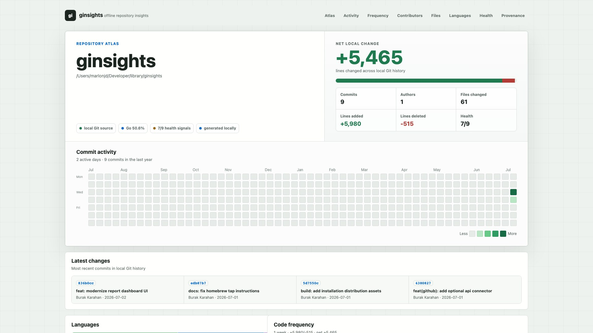

# ginsights

Local-first repository insights for commits, contributors, churn, language mix, and repo health.

`ginsights` is a single-binary Go CLI that turns local Git history into a polished Repository Atlas dashboard and JSON snapshot. It is built for quick repo handoffs, local audits, and shareable reports that do not require uploading code or connecting a SaaS account.



## Highlights

- Static HTML and JSON output that work offline.
- A full-width commit activity calendar, latest-change strip, contributor table, code-frequency view, hot files, languages, and repository health in one report.
- A local-first overview that shows net line change, commit volume, authors, touched files, primary language, and health signals without ranking people.
- Metric provenance labels so local Git data stays separate from optional GitHub API data.
- Optional disposable cache for faster repeated runs on larger repositories.
- Explicit GitHub connector only when `--github-api owner/name` is requested.

## Install

Homebrew:

```bash
brew tap marlonjd/tap
brew install ginsights
```

If Homebrew refuses the tap as untrusted, approve it explicitly:

```bash
brew trust marlonjd/tap
brew install ginsights
```

Shell installer:

```bash
curl -fsSL https://raw.githubusercontent.com/MarlonJD/ginsights/main/scripts/install.sh | bash
```

The shell installer builds from source and installs to `~/.local/bin/ginsights` by default. More options, including `--install-dir`, `--ref`, tap maintenance, and source builds, are in [docs/INSTALL.md](docs/INSTALL.md).

## Quick Start

```bash
ginsights serve . --port 43117
ginsights build . --out report
ginsights json .
```

Useful options:

```bash
ginsights serve . --since 2026-07-01
ginsights build . --out report --no-cache
GINSIGHTS_GITHUB_TOKEN=... ginsights build . --out report --github-api owner/name
ginsights cache-clear .
```

## Why This Exists

GitHub Insights is useful, but it is hosted and mixes local Git facts with GitHub server-side analytics. `ginsights` makes the local part fast, reproducible, and shareable without uploading code or requiring a token.

It is different from raw `git log` scripts because it provides a stable dashboard, JSON output, health signals, cache behavior, and metric provenance. It is different from SaaS engineering analytics because it does not rank people or require a hosted service.

The full rationale is in [docs/WHY.md](docs/WHY.md).

## Product Boundary

Core mode is local/offline. GitHub Traffic data such as views, clones, referrers, and popular content cannot be inferred from local Git history. When `--github-api owner/name` is used, API-sourced metrics are labeled as `github_api` and connector failures degrade into the report instead of breaking local analysis.

## Project Docs

- [Install](docs/INSTALL.md)
- [Why ginsights exists](docs/WHY.md)
- [Product specs](docs/product-specs/index.md)
- [Architecture](ARCHITECTURE.md)
- [Security](docs/SECURITY.md)
- [Plans](docs/PLANS.md)

## Development

```bash
go test ./...
go run ./cmd/ginsights doctor .
go run ./cmd/ginsights build . --out /tmp/ginsights-report
scripts/capture-ui-screenshots.sh --update-readme
```

When using Codex, start with [AGENTS.md](AGENTS.md), then open the active execution plan that matches the task.
